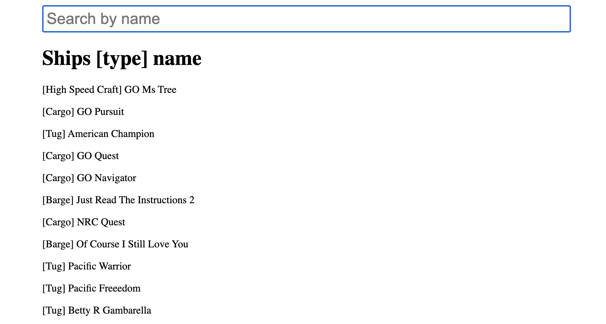

# react-graphql

React application using Apollo Graphql Client and Zustand state management

## Available Scripts

In the project directory, you can run:

### `npm install`

To install dependencies

### `npm start`

Runs the app in the development mode. 
Open [http://localhost:8080](http://localhost:8080) to view it in the browser.

The page will reload if you make edits. 
You will also see any lint errors in the console.

## Ouput

